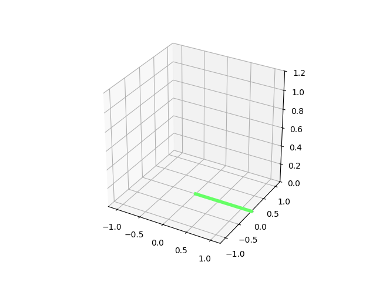
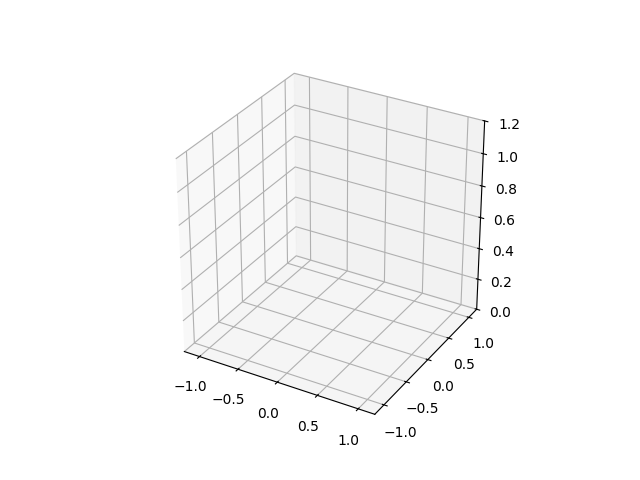

# 3DOF_Robot_Arm_Trajectory_Planning
This project demonstrates joint-space and Cartesian-space trajectory planning for a 3-DOF robotic arm in Python. Quintic time scaling is used to generate smooth motion between target positions, with results visualized through animated simulations.

## Features
- Joint-space trajectory planning using custom forward and inverse kinematics from a previous 3-DOF arm kinematics project
- Cartesian-space trajectory planning using the same kinematic solvers
- Matplotlib-based animation functions to visualise motion between end-effector targets
- Quintic time scaling for both trajectory planning methods

## Demo

**Joint-space trajectory planning (Quintic time scaling)


**Cartesian-space trajectory planning (Quintic time scaling)  


## Example usage
```python
# Joint Space

start_thetas = [0.0, 0.0, 0.0]
target_xyz = [-0.8, -0.6, 0.5]
lengths = [0.6, 0.6]
T  = 4.0
dt = 0.05
traj = joint_space_3dof(start_thetas, target_xyz, lengths, T, dt)

animate_3dof(traj, lengths)

# Cartesian Space

start_thetas = [0.0, 0.0, 0.0]
target_xyz = [-0.8, -0.6, 0.5]
lengths = [0.6, 0.6]
T  = 4.0 
dt = 0.05
traj = cartesian_3dof(start_thetas, target_xyz, lengths, T, dt)

animate_3dof(traj, lengths)

